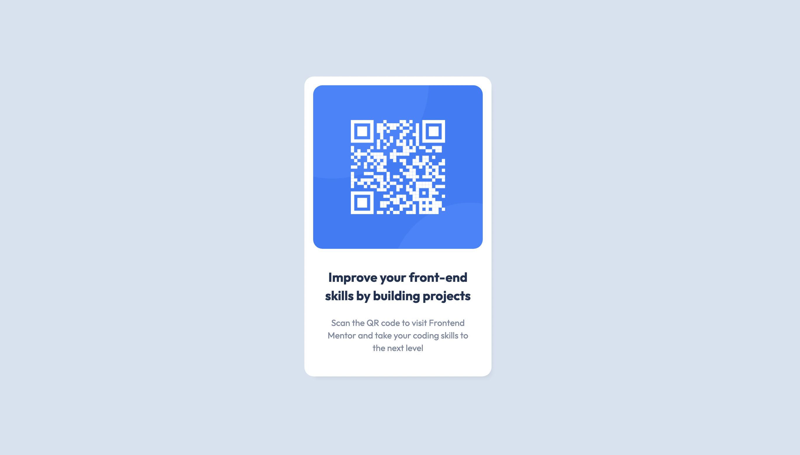

# Frontend Mentor - QR code component solution

A really fun and simple challenge to continue to sharpen my front end skills. 

This is a solution to the [QR code component challenge on Frontend Mentor](https://www.frontendmentor.io/challenges/qr-code-component-iux_sIO_H). Frontend Mentor challenges help you improve your coding skills by building realistic projects. 

## Table of contents

- [Overview](#overview)
  - [Screenshot](#screenshot)
  - [Links](#links)
- [My process](#my-process)
  - [Built with](#built-with)
  - [What I learned](#what-i-learned)
  - [Useful resources](#useful-resources)
- [Acknowledgments](#acknowledgments)

## Overview

### Screenshot
Desktop Screenshot

Mobile Screenshot

### Links

- Solution URL: TBA

## My process
- Think about 12 columns. Start from the outside and work your way in 

### Built with

- Semantic HTML5 markup
- CSS custom properties
- Flexbox
- Bootstrap

### What I learned
- Keep it simple. Use flexbot. 

### Useful resources

- [Box Shadow Resource 1](https://box-shadow.dev/) - This helped me create the box shadow. Website is very nicely designed and easy to use.
- [Bootstrap Resource 2](https://getbootstrap.com/docs/3.4/getting-started/) - CDN 

## Acknowledgments
- Everyone taking the time to get better every single day
